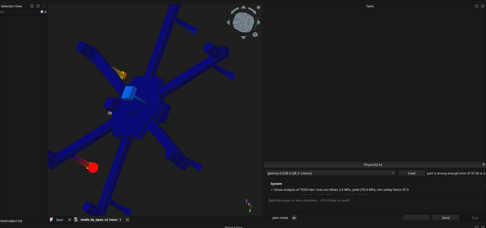

# PhysicsIQ

A local engineering copilot for FreeCAD:runs on a laptop GPU. has PINN for weak point detection



## Quick start

```bash
# 1. link the workbench into FreeCAD (uses symlinks — edits are live)
./scripts/dev_install.sh

# 2. PINN venv (JAX): one-time setup
uv pip install --python ~/.venvs/usage/bin/python "jax[cuda12]" optax

# 3. drop your .gguf model (+ mmproj-* for vision) into models/

# 4. start FreeCAD → workbench dropdown → "PhysicsIQ" → pick model → Load
```

